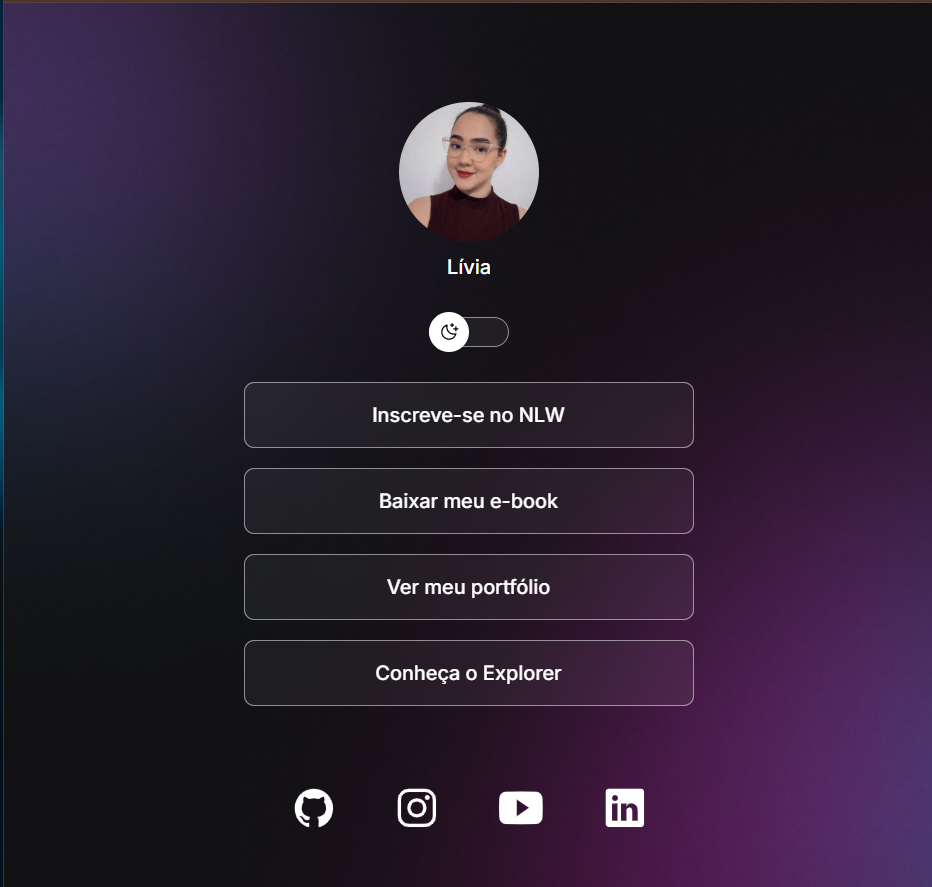
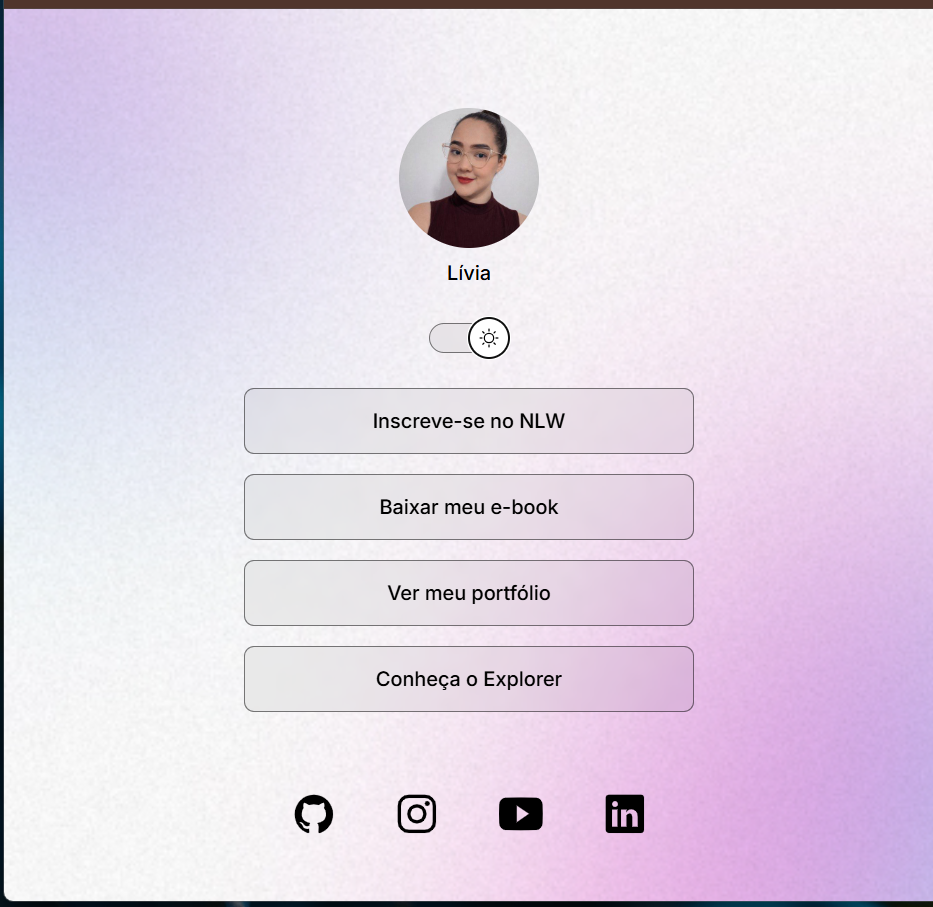

<div align="center">


# 🌙 DevLinks

### Um agregador de links pessoal moderno e responsivo

Projeto desenvolvido durante o curso da **Rocketseat** utilizando HTML, CSS e JavaScript.

<br>


</div>

---

## 📖 Sobre o projeto

O **DevLinks** é uma página de apresentação pessoal criada para reunir links importantes em um único lugar.

A proposta foi desenvolver uma interface simples, bonita e funcional, aplicando conceitos fundamentais de desenvolvimento web.

O projeto conta com:

<div align="center">

✨ Interface moderna  
<br>
🌙 Tema claro e escuro  
<br>
📱 Design responsivo  
<br>
🔗 Links personalizados  
<br>
🎨 Estilo glassmorphism  

</div>

---

# 🖥️ Preview

<div align="center">

## 🌙 Dark Mode



<br><br>

## ☀️ Light Mode



</div>


---

# 🚀 Tecnologias

<div align="center">


</div>

<br>

| Tecnologia | Utilização |
|---|---|
| HTML5 | Estrutura da página |
| CSS3 | Estilização, layout e temas |
| JavaScript | Alternância de tema |
| Ionicons | Ícones das redes sociais |

---

# ✨ Funcionalidades

## 🌗 Dark / Light Mode

Sistema de troca de tema utilizando:

- JavaScript para manipulação da classe
- Variáveis CSS para controle das cores

O usuário consegue alternar entre:

🌙 Modo escuro  
☀️ Modo claro


## 🔗 Links personalizados

A página permite adicionar:

- Portfólio
- Redes sociais
- Projetos
- Materiais pessoais


## 🎨 Design

O projeto utiliza:

- Fundo personalizado
- Efeito de transparência
- Botões com animação hover
- Layout centralizado

---

# 📂 Estrutura do projeto

```bash
DevLinks/
│
├── index.html
├── styles.css
├── script.js
│
└── assets/
    │
    ├── bg-mobile.jpg
    ├── bg-mobile-light.jpg
    ├── MoonStars.svg
    ├── Sun.svg
    ├── preview-dark.png
    └── preview-light.png
```

---

# ▶️ Como executar

Clone o repositório:

```bash
git clone https://github.com/Livia2710/DevLinks.git
```

Entre na pasta:

```bash
cd DevLinks
```

Abra o arquivo:

```bash
index.html
```

no navegador.

---

# 🔗 Meus links

<div align="center">

<a href="https://github.com/Livia2710">

</a>

<a href="https://my-portfolio-beta-inky-75.vercel.app/">

</a>

<a href="https://www.linkedin.com/in/l%C3%ADvia-figueiredo/">

</a>

</div>

---

<div align="center">

### Feito com 💜 por Lívia

⭐ Se gostou do projeto, deixe uma estrela!

</div>
